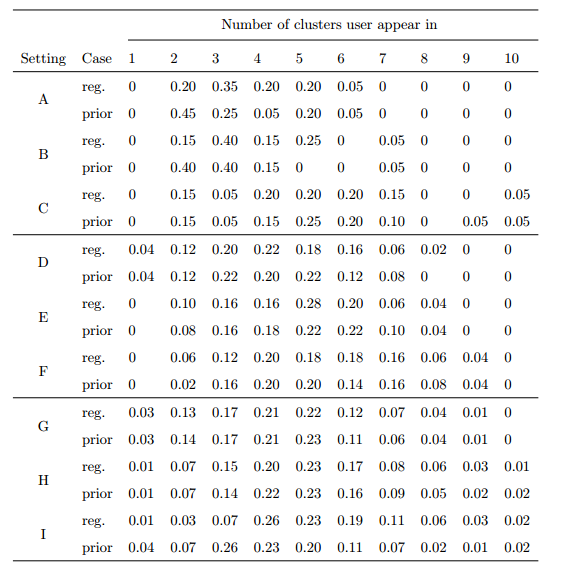

[](http://quantlet.de/index.php?p=info)

## [](http://quantlet.de/) **Bitcoin_Evaluation** [](http://quantlet.de/d3/ia)

```yaml

Name of Quantlet : Bitcoin_Evaluation

Published in : Q-Kolleg Seminar Paper

Description : 'Analyzes transaction data obtained by Bitcoin_Evaluation.R. Connects and clusters
Bitcoin addresses to approximate the true users. Returns a table of how well the users are assigned
to the optimal clusters.'

Keywords : Bitcoin, Crypto, Simulation, Blockchain, Network

Author : Lara Vomfell, Jiejie Zhang

Submitted by : Wed, Sep 8 2016 by Jiejie Zhang

```




### R Code:
```r
NA
```
